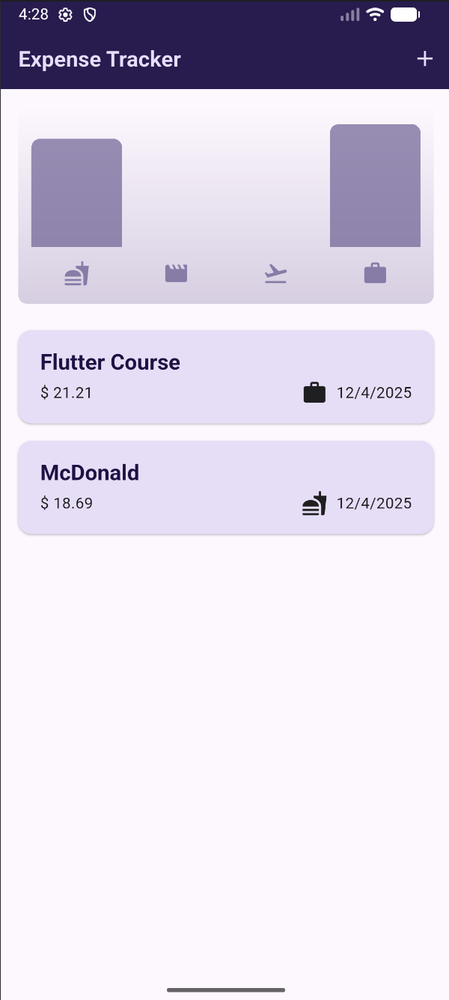
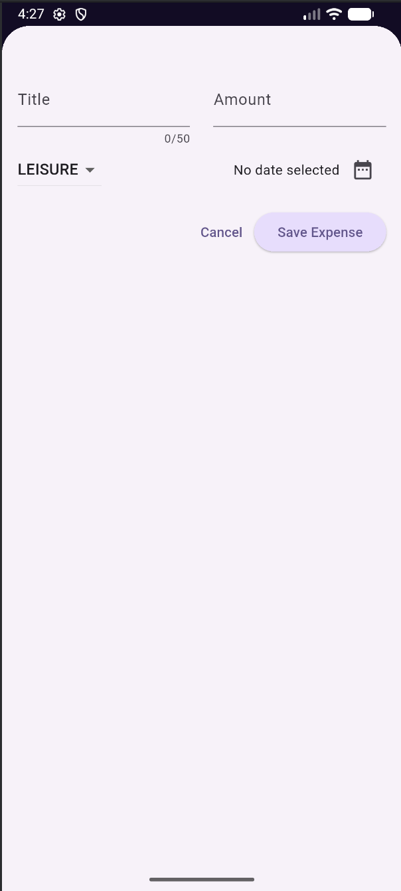

# Expense Tracker

A simple Flutter application for tracking daily expenses with a clean UI, charts, and basic state management.

## Screenshots

  


## Features

- Add and delete expenses
- Undo deletion
- Category-based chart
- Responsive layout

## Structure

```
lib/
  main.dart
  expenses.dart
  new_expense.dart
  models/
    expense.dart
  widgets/
    chart.dart
    chart_bar.dart
    expenses_list.dart
    expense_item.dart
```

## Run

```bash
flutter pub get
flutter run
```

## Requirements

- Flutter 3.0 or later

---